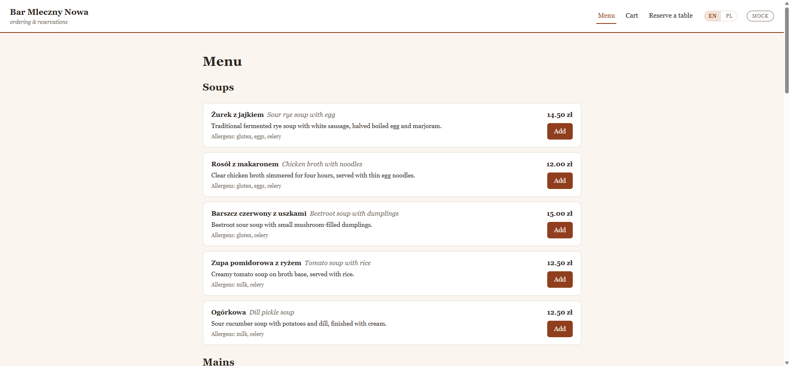
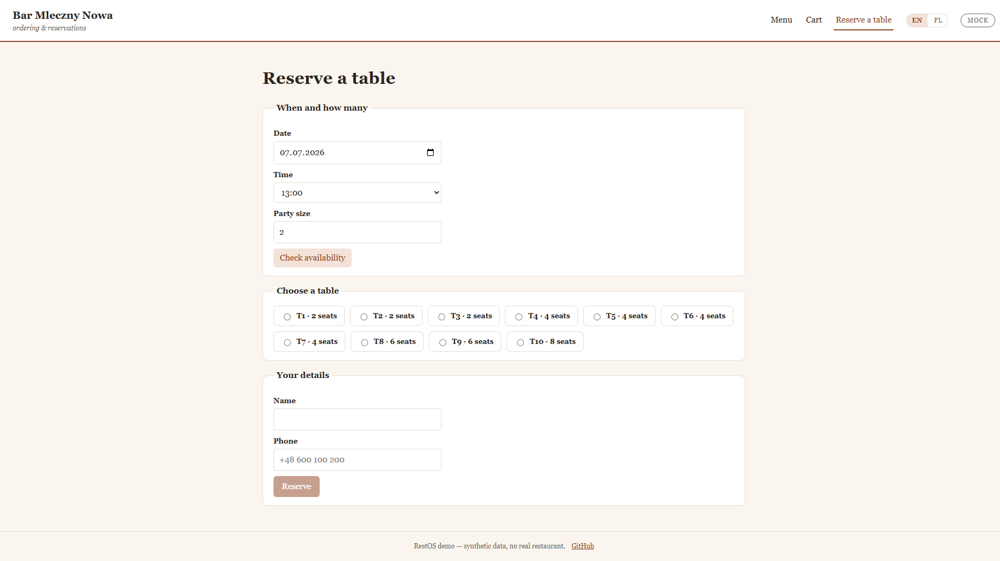
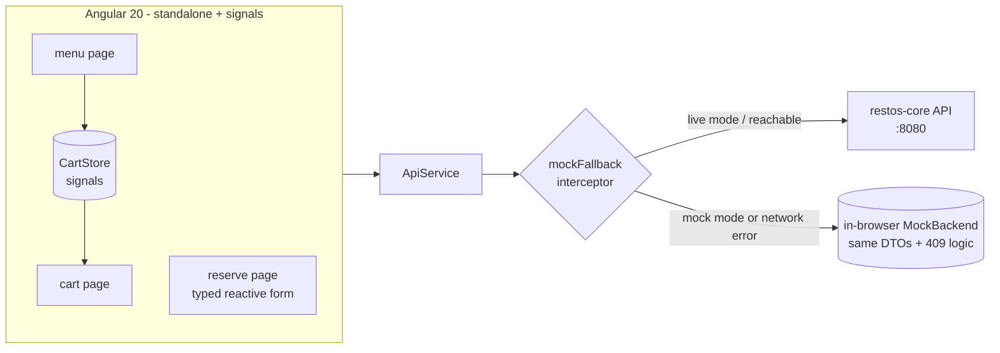

# restos-web

Customer-facing ordering and reservations UI for the RestOS ecosystem, built with Angular 20 —
standalone components, signals, typed reactive forms, EN/PL internationalization and an
accessibility pass. It consumes the [restos-core](https://github.com/arcsymer/restos-core) REST
API when it's running and transparently falls back to a deterministic in-browser mock backend
when it isn't, so the whole thing runs from a static page with zero setup.


[](https://github.com/arcsymer/restos-web/actions/workflows/ci.yml)


**▶ Live demo (mock mode, GitHub Pages): <https://arcsymer.github.io/restos-web/>**
&nbsp;·&nbsp; Polish: <https://arcsymer.github.io/restos-web/pl/>





## Quickstart

Prerequisites: **Node 22+** and **pnpm**.

```sh
git clone https://github.com/arcsymer/restos-web && cd restos-web
pnpm install
pnpm start
```

Open <http://localhost:4200>. No backend needed — with nothing on `:8080` the app auto-switches
to the in-browser mock backend (watch the header chip flip to `mock`). To drive it against the
real API, run [restos-core](https://github.com/arcsymer/restos-core) on `:8080` first.

## Architecture



The interceptor decides per request: in `mock` mode (or when a live call returns a network
error) it serves from an in-memory backend that mirrors restos-core's DTOs and conflict
semantics; otherwise it passes through to the real API. The order endpoint is mock-only (see
Limitations).

## Features

1. **Ordering** — browse the menu by category, add to a signals-backed cart, review totals,
   place an order (mock-served) with a confirmation.
2. **Reservations** — typed reactive form (date/time/party/name/phone) with inline validation,
   availability search, table picker, and a confirmation; server 409/400 problem-details surface
   inline.
3. **Standalone + signals** — no NgModules; lazy-loaded routed components; `CartStore` built from
   `signal`/`computed`.
4. **Transparent mock fallback** — an HTTP interceptor serves an in-browser backend when the API
   is unreachable or mock mode is toggled, so the app is fully usable offline/standalone.
5. **i18n EN/PL** — Angular `$localize`; all 48 strings translated; the production build emits
   both locales (`/en-US/`, `/pl/`) with a header language switcher.
6. **Accessibility** — semantic landmarks, labelled controls, focus moved to content on route
   change, keyboard-operable cart; axe (WCAG 2 A/AA) runs in e2e with no serious/critical
   violations.
7. **Tested + deployed** — 15 unit tests (Karma) and 8 Playwright e2e (order, reservation,
   validation, auto-fallback, plus axe scans); CI runs build + unit + e2e + gitleaks; the mock
   build auto-deploys to GitHub Pages.

## Testing & CI

```sh
pnpm run build          # production build (localized: en-US + pl)
pnpm run test:ci        # unit tests, headless Chrome

pnpm exec playwright install chromium   # once, on a fresh clone
pnpm run e2e            # Playwright e2e + axe (auto-starts the dev server)
```

CI (GitHub Actions): `build` (build + unit), `e2e` (Playwright in mock mode + axe), and a
gitleaks history scan; a separate workflow deploys the localized build to Pages on every push.

## Limitations

- **Order submit is mock-only.** restos-core has no orders endpoint in its MVP, so ordering is
  always served by the in-browser mock (a real endpoint is a restos-core v2 idea). Reservations
  and the menu use the real API when it's running.
- The mock backend keeps state in memory for the tab's lifetime only — a refresh resets it.
- Anyone can create/see reservations; there's no auth (matches the restos-core MVP).
- All data is synthetic (one fictional milk bar). No real users or restaurant.
- The demo is deployed in permanent mock mode (GitHub Pages is static — there's no backend to
  reach), which also exercises the fallback path end to end.

## v2 ideas

Real orders endpoint wired through; auth; PWA/offline menu; richer animations; visual-regression
tests.

## License & attribution

MIT — see [LICENSE](LICENSE). Part of the [RestOS](https://github.com/arcsymer) portfolio.

Built end-to-end with an agentic workflow (Claude Code), orchestrated, reviewed, and directed by me.
